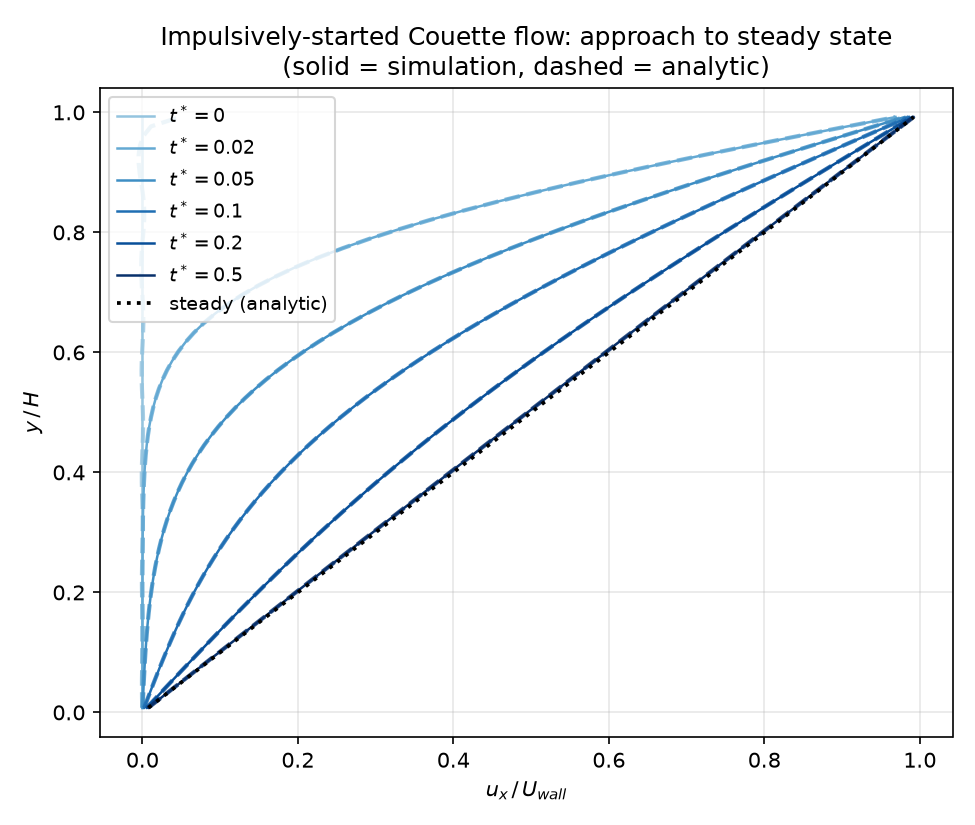

# Couette Flow
This demonstrates a couple ways to setup the Couette Flow problem. This uses bounce-back boundary conditions to replicate no-slip walls.

Flow starts static and then the top wall begins moving at a constant rate $U_\mathrm{wall}$. The flow evolves to a linear profile from $U_x(y=0) = 0$ to $U_x(y=H) = U_\mathrm{wall}$ where $H$ is the height in the y-direction.

The flow reaches this linear state  in a characteristic manner shown here (recreate by running `python plot_snapshots.py`):

## Convergence Test
Here a simple python script utlitizes the `Grid` class as well as the `do_stream` and `do_collision` functions to evolve the simulation.

This test looks to ensure the steady-state solution (linear flow) is replicated. Then a convergence test looking at how the flow evolves from static conditions toward that linear solution.

We test a number of resolutions from 4x8 to 4x128. Each jump in resolution corresponds with doubling the size of the domain. To keep the Re and viscosity constant we decrease the wall velocity `Uwall` by half with each resolution jump.

The standard LBM implemented here should be second order accurate.

## Single sim run
The Couette problem is implemented in `crawLBM` and can be run from the command line as shown using the `run_couette.sh` bash script and accompanying python file `init_sim.py`. These output a number of plots and looks how the simulation evolves to the analytic steady state solution.
