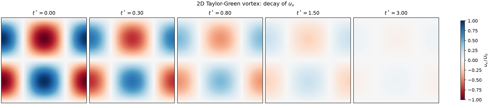
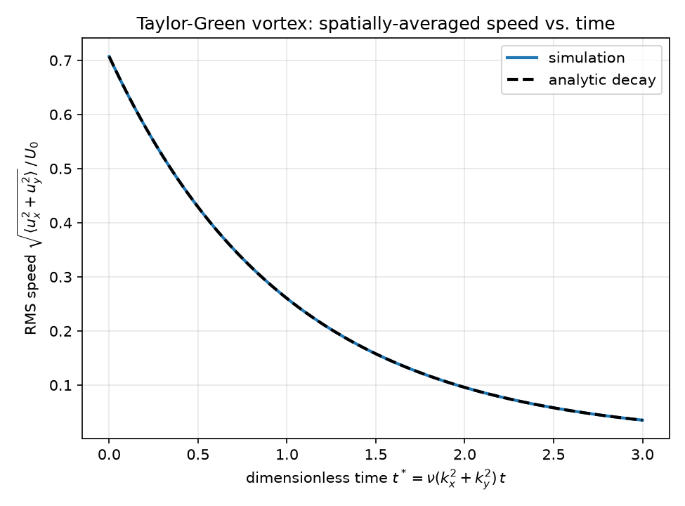

# Taylor-Green Vortex Decay
This demonstrates a couple ways to setup the Taylor-Green vortex decay problem. 

The flow is initialized in a sinusoidal manner and evolves by exponentially decaying over time. By running `python plot_snapshots.py`, we can produce plots for the velocity overtime:

## Convergence Test
Here a simple python script utlitizes the `Grid` class as well as the `do_stream` and `do_collision` functions to evolve the simulation.

We test a number of resolutions from 16x16 to 256x256. Each jump in resolution corresponds with doubling the size of the domain. To keep the Re and viscosity constant we decrease the velocity `U_0` by half with each resolution jump.

The standard LBM implemented here should be second order accurate.

## Single sim run
The TGV problem is implemented in `crawLBM` and can be run from the command line as shown using the `run_TGV.sh` bash script and accompanying python file `init_sim.py`. These output a number of plots and try to compare the simulation results to the analytic solution.
